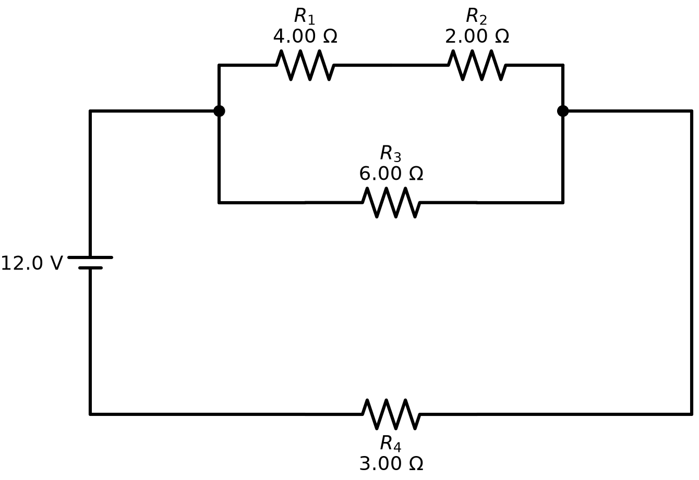
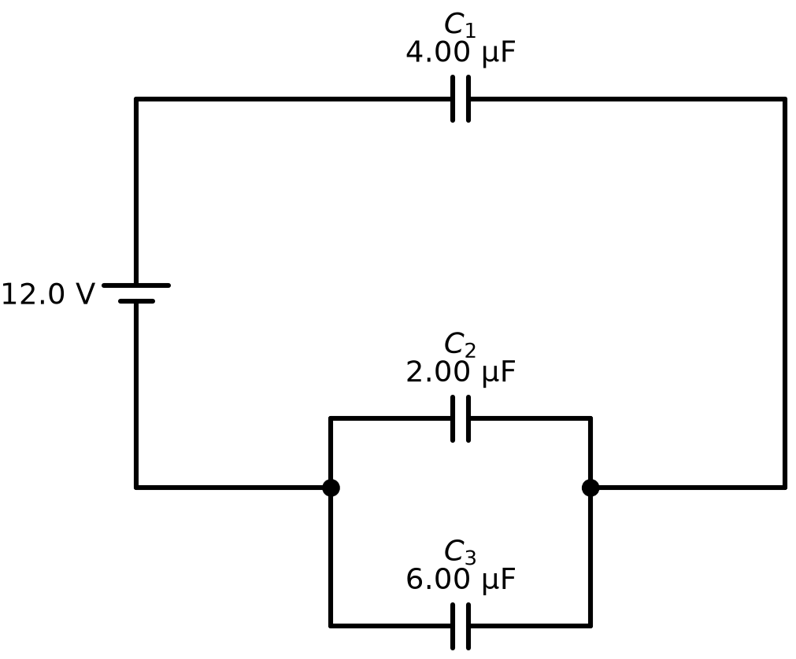
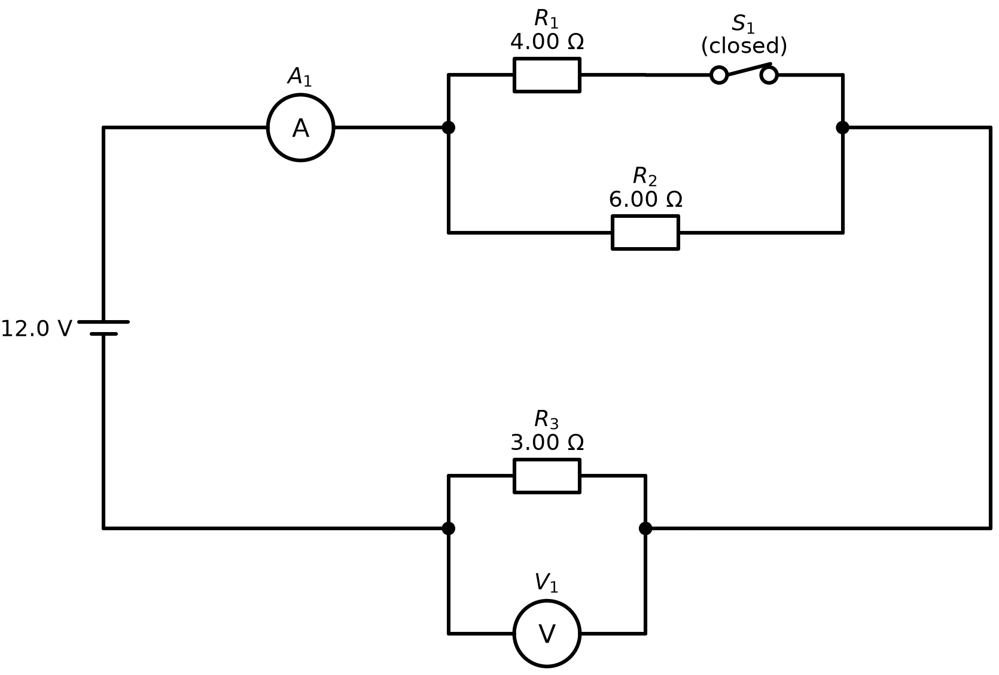

# circuit-diagram-skill

A sharable [Agent Skill](https://agentskills.io) for Cursor, Claude Code and other agents: describe a DC circuit
in plain English, get a worksheet-style circuit diagram (PNG, SVG, PDF) and, if you want, the answers and a
worked solution.

```
"12 V battery, a 4 ohm and a 2 ohm in series, that pair in parallel with a 6 ohm, then a 3 ohm.
 Find the current through the 2 ohm resistor."
```
```
source: 12 V                       ->   examples/series_parallel.png
circuit: (4 + 2) || 6 + 3
ask: current through R2
```


## How it works
| Step | Tool | AI involved? |
|---|---|---|
| English → circuit lingo | fixed phrase rules in `scripts/lingo.py` (`translate`) | no |
| lingo → circuit tree | hand-written parser (`parse`) | no |
| tree → figure | worksheet-style layout writing [Schemdraw](https://schemdraw.readthedocs.io/) code (`draw_code`), rendered by Schemdraw + Matplotlib (`scripts/render_worker.py`) | no |
| answers (optional) | series/parallel reduction with worked steps (`solve`) | no |
| a sentence the rules cannot read | the agent writes the lingo itself, following `SKILL.md`, and the script checks it | yes, only then |

The same words always give the same lingo and the same picture. When the rules cannot read a sentence, the
script says which word, and the agent (Cursor / Claude) writes the lingo instead - that lingo still goes
through the same parser and drawing code, and the skill tells the agent to show it to the user.

## Install
The repo folder *is* the skill. Clone it into the skills folder of your agent:

```bash
# Cursor (all projects)              # Cursor (one project)
git clone https://github.com/myrlaphil/circuit-diagram-skill ~/.cursor/skills/circuit-diagram-skill
git clone https://github.com/myrlaphil/circuit-diagram-skill .cursor/skills/circuit-diagram-skill

# Claude Code (all projects)         # Claude Code (one project)
git clone https://github.com/myrlaphil/circuit-diagram-skill ~/.claude/skills/circuit-diagram-skill
git clone https://github.com/myrlaphil/circuit-diagram-skill .claude/skills/circuit-diagram-skill

```
No `pip install` needed: the first run creates a private `.venv` inside the skill folder with schemdraw and
matplotlib (about a minute). If you prefer your own environment, `pip install -r requirements.txt` works too.

Then ask the agent for a circuit: *"draw a 9 V battery with three 6 ohm resistors in parallel, IEC symbols"*.
Both tools read the same `SKILL.md` (the open Agent Skills format), so nothing needs translating between them.

## Use it without an agent
```bash
python scripts/draw_circuit.py "9 V battery, a 3 ohm and a 6 ohm in parallel, then a 4 ohm. Find the total current." --out figures/p1 --solve
python scripts/draw_circuit.py --lingo "source: 12 V
circuit: A1 + (4 + 2) || 6 + 3 || V1
ask: reading of A1, reading of V1" --standard IEC
python scripts/draw_circuit.py --file problem.txt --formats png
```
The script prints one JSON object (lingo, files, question, answers, ...) and returns exit code 0 on success,
2 when the rules could not read the sentence, 3 for invalid lingo, 4 for a drawing error.

## Settings: `config.json`
| Key | Values | Meaning |
|---|---|---|
| `symbol_standard` | `US` / `IEC` | zig-zag (IEEE, American textbooks) or box (IEC) resistors |
| `labels` | `name_and_value` / `value` / `name` | what resistor and capacitor labels show |
| `formats` | any of `png`, `svg`, `pdf` | files written for each drawing |
| `dpi` | number | PNG resolution (220 prints well) |
| `font_size` | number | label size |
| `output_dir` | folder | default folder when `--out` has none |
| `solve` | `true` / `false` | always write the answers and worked solution |

Keys starting with `_` are comments. `--config other.json` uses another file; `--standard`, `--labels`,
`--formats`, `--solve` override single settings for one run.

## Circuit lingo in one minute
`+` series · `||` parallel (binds tighter) · `( )` group · `4` resistor (Ω) · `4uF` capacitor · `S1=closed`
switch · `A1` ammeter in series · `6 || V1` voltmeter across the 6 Ω · `6?` hidden value. Parts are drawn in the
order written: first on the top rail, the last series part on the bottom rail, parallel branches stacked.
Full reference and the English phrases the rules understand: [SKILL.md](SKILL.md).

## More examples
| | |
|---|---|
|  | `source: 12 V` `circuit: 4uF + 2uF \|\| 6uF` - *a 2 uF and a 6 uF capacitor in parallel, then a 4 uF capacitor in series with that pair* |
|  | `source: 12 V` `circuit: A1 + (4 + S1=closed) \|\| 6 + 3 \|\| V1` - *an ammeter, then a 4 ohm in series with a closed switch, that pair in parallel with a 6 ohm, then a 3 ohm, a voltmeter across the 3 ohm* |

## Tests
`python -m pytest` - hand-worked answers for the solver, one test per English phrase pattern, and the
command-line script end to end. They run on every push (GitHub Actions).

## Related
The same engine powers a point-and-click web version: https://myrlaphil.github.io/Test-Circuit-Generator/
(source: https://github.com/myrlaphil/Test-Circuit-Generator). `scripts/lingo.py` and
`scripts/render_worker.py` are copies of that project's files.

MIT licensed.
